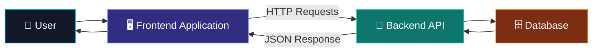

<div align="center">

# 📦 Inventory Management System

### Modern inventory control interface for managing products, stock, and business operations

<br>


<br><br>

<a href="https://github.com/romilleuva/inventory-management-system-frontend">

</a>
<a href="https://github.com/romilleuva/inventory-management-system-frontend">

</a>
<a href="https://github.com/romilleuva/inventory-management-system-frontend">

</a>

<br><br>


</div>

---

## ✨ Overview

Inventory Management System is a frontend application designed to help businesses organize products, monitor stock levels, and manage inventory operations from one clean dashboard.

The frontend communicates with a dedicated backend API:

🔗 [Inventory Management System Backend](https://github.com/romilleuva/inventory-management-system-backend)

---

## 🎯 Core Features

| Feature | Description |
|---|---|
| 📊 Dashboard | View important inventory information |
| 📦 Product management | Add, update, view, and manage products |
| 📈 Stock monitoring | Track available inventory |
| 🔍 Search and filtering | Find products quickly |
| 🧾 Organized interface | Manage data through a clean UI |
| 🔐 API integration | Connect with the backend service |
| 📱 Responsive design | Use the application across screen sizes |

---

## 🧬 Application Flow



---

## 🛠️ Tech Stack

<div align="center">


</div>

---

## 📁 Project Structure

```text
inventory-management-system-frontend/
├── public/
├── src/
│   ├── components/
│   ├── pages/
│   ├── services/
│   ├── hooks/
│   ├── assets/
│   └── App.*
├── .env.example
├── package.json
└── README.md
```

> Adjust the structure to match the actual repository.

---

## 🚀 Getting Started

### 1. Clone the repository

```bash
git clone [https://github.com/romilleuva/inventory-management-system-frontend.git](https://github.com/romilleuva/inventory-management-system-frontend.git)
cd inventory-management-system-frontend
```

### 2. Install dependencies

```bash
npm install
```

### 3. Configure environment variables

Create a `.env` file:

```env
VITE_API_URL=http://localhost:5000
```

> Replace the variable name and API URL with the values used by the project.

### 4. Start the development server

```bash
npm run dev
```

Open the local URL shown in your terminal.

### 5. Build for production

```bash
npm run build
```

---

## 🔗 Backend Connection

This frontend is designed to work with:

[Inventory Management System Backend](https://github.com/romilleuva/inventory-management-system-backend)

Typical local setup:

```text
Frontend: http://localhost:3000
Backend:  http://localhost:5000
```

> Confirm the actual ports and API routes in the source code before publishing.

---

## 🖼️ Screenshots

Add screenshots to a folder such as `screenshots/` and update the paths below:

<div align="center">

| Dashboard | Products |
|---|---|
| `screenshots/dashboard.png` | `screenshots/products.png` |

</div>

---

## 🔐 Environment Variables

| Variable | Purpose |
|---|---|
| `VITE_API_URL` | Backend API base URL |

Never commit passwords, tokens, private keys, or production secrets.

---

## 🗺️ Roadmap


---

## 🤝 Contributing

1. Fork the repository.
2. Create a feature branch.
3. Make your changes.
4. Test the application.
5. Open a pull request.

```bash
git checkout -b feature/improvement
git commit -m "Add improvement"
git push origin feature/improvement
```

---

## 📄 License

Add the project license here.

---

<div align="center">

### Built for simpler inventory management

<a href="https://github.com/romilleuva/inventory-management-system-frontend">

</a>

<a href="https://github.com/romilleuva/inventory-management-system-backend">

</a>

<br><br>


</div>
